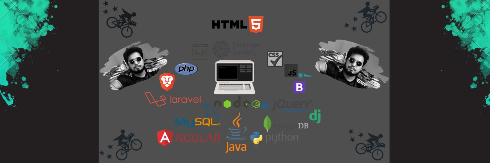
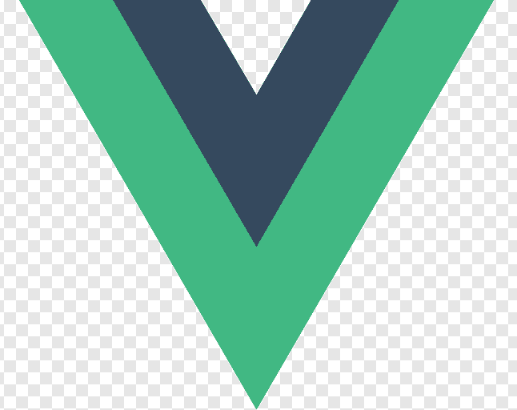

<h1 align="center">Hi there 👋, I'm Osim Kumar Roy Akash</h1>

    

    

    <b>Web Developer | 1+ years experience</b> 
    Developed web-based applications, including online training software and more.

---

<h3 align="center">🛠️ Technologies & Tools</h3>

    
    
    
    
    
    
    
    
    
    

---

<h3 align="center">🚀 Problem Solving</h3>

    
    
    

---

<table align="center">
    <tr>
        <td>🔭 I’m currently working on</td>
        <td>...</td>
    </tr>
    <tr>
        <td>🌱 I’m currently learning</td>
        <td>...</td>
    </tr>
    <tr>
        <td>👯 I’m looking to collaborate on</td>
        <td>...</td>
    </tr>
    <tr>
        <td>🤔 I’m looking for help with</td>
        <td>...</td>
    </tr>
    <tr>
        <td>💬 Ask me about</td>
        <td>...</td>
    </tr>
    <tr>
        <td>📫 How to reach me</td>
        <td>...</td>
    </tr>
    <tr>
        <td>😄 Pronouns</td>
        <td>...</td>
    </tr>
    <tr>
        <td>⚡ Fun fact</td>
        <td>...</td>
    </tr>
</table>

---

    

